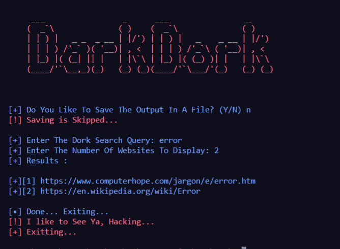

# DarkDork   

<p>
<a href="https://github.com/TheSadError"></a>
<a href="https://www.youtube.com/channel/UCUfTuo3-85qD_7v1n-W98rw"></a>
</p>
Fast dorking with DarkDork. Written with python. Please run it with python3 versions. You can find vulnerability url s. Used Packets : google,sys,time,os and colorama.
Discord : err0r#4018

## Installing
```
git clone https://github.com/TheSadError/DarkDork
cd DarkDork
sudo python3 main.py

```

<div>
  <p align="center">
     
  </p>
</div>


```
For Educational Purposes
```
